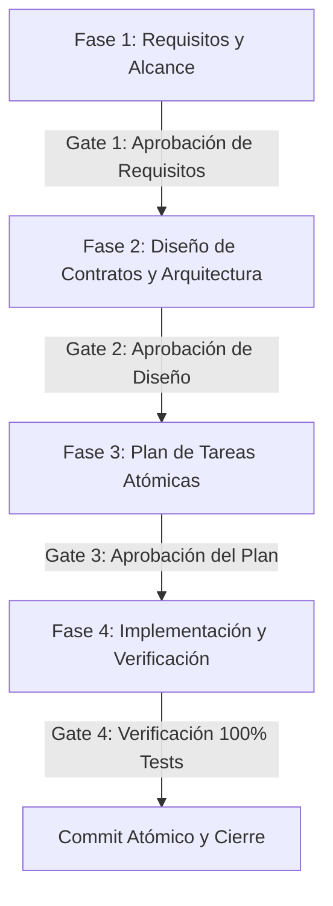

# Spec-Driven Development (SDD) — Guía Metodológica Integral

> **Fuente:** *SDD — Spec Driven Development: Cuando el código es la consecuencia (Desarrollo dirigido por SDD en equipos ágiles con IA)* — Juan Palacio (Scrum Manager, 2026).

---

## 1. El Cambio de Paradigma: Del "Vibe Coding" al SDD

### Los 3 Problemas Estructurales del Vibe Coding (Programar sin Spec):
1. **Degradación por pérdida de contexto (Context Drift / Rot):** A medida que la conversación avanza, los agentes de IA olvidan decisiones arquitectónicas previas, inventan nombres o duplican lógica.
2. **Imposibilidad de auditoría y mantenimiento:** Código generado sin especificación produce deuda técnica invisible, dependencias circulares y efectos secundarios no testeados.
3. **Alto coste de reescritura:** Corregir código ya escrito sin spec cuesta 5 a 10 veces más que validar y acordar la spec antes de escribir la primera línea.

### La Regla de Oro de SDD:
> **"El código es la consecuencia de una especificación clara, nunca el punto de partida."**
> La **Spec** es el artefacto primario de desarrollo; el código fuente es un subproducto derivado.

---

## 2. El Flujo de 4 Fases y Puertas de Aprobación (Approval Gates)

Cada requerimiento, funcionalidad o refactorización DEBE ejecutarse atravesando estrictamente las 4 fases secuenciales:



### 🧩 FASE 1: ESPECIFICACIÓN DE REQUISITOS (Requirements Spec)
- **Objetivo:** Definir el *QUÉ* y el *POR QUÉ* antes del *CÓMO*.
- **Contenido obligatorio:**
  - Descripción del problema o caso de uso.
  - Historias de usuario / Casos de uso con criterios de aceptación explícitos (formato GIVEN-WHEN-THEN).
  - Precondiciones (ej. *El usuario debe tener rol ADMIN*, *El stock del producto debe ser > 0*).
  - Postcondiciones esperadas (ej. *Se descuenta el stock*, *Se genera registro en bitácora*, *Se actualiza la vista*).
  - Casos borde y manejo de errores esperados (ej. *¿Qué ocurre si el SKU está duplicado?*, *¿Qué ocurre con stock insuficiente?*).
- **Puerta de Aprobación 1 (Gate 1):** Validar con el usuario el alcance antes de diseñar modelos.

---

### 📐 FASE 2: DISEÑO DE CONTRATOS Y ARQUITECTURA (Design Spec)
- **Objetivo:** Definir interfaces, contratos de datos y arquitectura sin escribir la implementación interna.
- **Contenido obligatorio:**
  - **Módulos impactados:** Identificar a cuál de los 5 módulos pertenece (`catalogo`, `inventario`, `compras`, `ventas`, `sistema`, `frontend`).
  - **Contratos DTO / Entidades:** Nombres de clases, atributos, tipos de datos y validaciones Jakarta (`@NotNull`, `@NotBlank`, `@Min`).
  - **Contratos REST:**
    - Método HTTP (`GET`, `POST`, `PUT`, `DELETE`).
    - Endpoint URL canónico (ej. `/api/productos`, `/api/ventas`).
    - Payload JSON de entrada (Request Body).
    - Códigos de respuesta HTTP y JSON de salida (`200 OK`, `201 Created`, `400 Bad Request`, `404 Not Found`).
  - **Diagrama de interacción / Flujo de datos** si involucra múltiples servicios.
- **Puerta de Aprobación 2 (Gate 2):** El usuario revisa y aprueba el diseño y contratos.

---

### 📝 FASE 3: PLAN DE TAREAS ATÓMICAS (Task Breakdown Spec)
- **Objetivo:** Descomponer el diseño en tareas atómicas, ordenadas por dependencias.
- **Reglas de las tareas:**
  - Cada tarea debe ser **pequeña, autocontenida y verificable**.
  - Orden lógico: *Modelo/Entidad ➔ Repositorio ➔ DTO ➔ Servicio e Impl ➔ Controlador ➔ Frontend Service ➔ Componente/Vista ➔ Tests*.
  - Indicar para cada tarea los archivos exactos a crear `[NEW]`, modificar `[MODIFY]` o eliminar `[DELETE]`.
  - Actualizar preventivamente [FILE_INDEX.md](file:///c:/Users/PERSONAL/Documents/AlejandroGerardSejas/inventario/.agents/FILE_INDEX.md).
- **Puerta de Aprobación 3 (Gate 3):** Plan presentado como `implementation_plan.md` aprobado por el usuario.

---

### 💻 FASE 4: IMPLEMENTACIÓN Y VERIFICACIÓN (Implementation & Testing)
- **Objetivo:** Traducir las especificaciones en código limpio y validarlo exhaustivamente.
- **Reglas de ejecución:**
  - Ejecutar tarea por tarea sin saltarse pasos ni mezclar alcances.
  - Aplicar **Clean Code** en cada línea escrita.
  - Validación continua: compilación incremental (`mvnw test-compile` y `npm run lint`).
  - Verificación total: correr tests automatizados (`mvnw test`) con **100% de éxito y 0 fallos**.
  - Registrar la acción detallada en [AUDIT_LOG.md](file:///c:/Users/PERSONAL/Documents/AlejandroGerardSejas/inventario/.agents/AUDIT_LOG.md).
  - Realizar commit atómico siguiendo la convención de [git-workflow](file:///c:/Users/PERSONAL/Documents/AlejandroGerardSejas/inventario/.agents/skills/git-workflow/SKILL.md).

---

## 3. Sistema de Límites y Fronteras (Boundaries System)

El agente debe operar bajo tres niveles de fronteras estrictas:

```
┌─────────────────────────────────────────────────────────────┐
│ 🟢 ALWAYS (Hacer siempre sin preguntar)                    │
│    - Validar DTOs con @Valid y anotaciones Jakarta          │
│    - Usar inyección por constructor (@RequiredArgsConstructor)│
│    - Escribir tests unitarios para servicios                │
│    - Manejar errores con GlobalExceptionHandler             │
│    - Mantener FILE_INDEX.md y AUDIT_LOG.md actualizados      │
│    - Dejar el código compilando al 100%                     │
├─────────────────────────────────────────────────────────────┤
│ 🟡 ASK FIRST (Detenerse y consultar antes de ejecutar)      │
│    - Modificar contratos de API existentes (breaking changes)│
│    - Eliminar tablas, entidades o endpoints existentes       │
│    - Añadir nuevas librerías o dependencias Maven/NPM       │
│    - Alterar la estructura de los 5 módulos de dominio      │
├─────────────────────────────────────────────────────────────┤
│ 🔴 NEVER (Prohibición estricta y absoluta)                 │
│    - Escribir código sin una spec o plan previo             │
│    - Inyectar con @Autowired en campos privados             │
│    - Retornar entidades JPA directamente en Controllers     │
│    - Devolver 'null' en métodos de negocio                  │
│    - Colocar 'fetch()' dispersos dentro de componentes React│
│    - Dejar bloques 'catch(Exception e) {}' vacíos           │
└─────────────────────────────────────────────────────────────┘
```

---

## 4. Anatomía de una Buena Spec (Template Canónico)

```markdown
# [SPEC-ID]: [Nombre de la Funcionalidad]

## 1. Contexto y Problema
[Qué necesidad de negocio o técnica resuelve]

## 2. Historias de Usuario & Criterios de Aceptación (Given-When-Then)
- **Escenario 1 (Éxito):**
  - GIVEN: [Estado inicial del sistema]
  - WHEN: [Acción del usuario o petición recibida]
  - THEN: [Resultado esperado y cambios en el sistema]
- **Escenario 2 (Error/Validación):**
  - GIVEN: [...]
  - WHEN: [...]
  - THEN: [Mensaje de error y código HTTP esperado]

## 3. Contratos de Datos y APIs
- **Módulo:** `catalogo | inventario | compras | ventas | sistema`
- **DTOs:** [Clases y campos con validaciones]
- **Endpoint:** `[METODO] /api/[ruta]`
- **Request Body:** `{ ... }`
- **Response (200/201):** `{ ... }`
- **Response (400/404):** `{ "error": "...", "status": 400 }`

## 4. Plan de Tareas Atómicas
1. [ ] Tarea 1: [Crear DTO y Entidad] → `[NEW] Archivo.java`
2. [ ] Tarea 2: [Implementar lógica en Service e Impl] → `[MODIFY] ServiceImpl.java`
3. [ ] Tarea 3: [Crear Endpoint en Controller] → `[MODIFY] Controller.java`
4. [ ] Tarea 4: [Integrar cliente en frontend/src/services/api.js]
5. [ ] Tarea 5: [Crear componente/modal de UI]
6. [ ] Tarea 6: [Tests unitarios y de integración]

## 5. Plan de Verificación
- Comando de tests backend: `cmd /c mvnw.cmd test`
- Verificación en UI: [Flujo manual de comprobación en pantalla]
```

---

## 5. Anti-Patrones de SDD a Evitar

* ❌ **Vibe Refactoring:** Empezar a cambiar archivos sin definir primero qué clases se tocan y qué contratos cambian.
* ❌ **Mega-Prompting:** Intentar implementar backend, base de datos, frontend y estilos en un solo paso gigantesco sin validar incrementalmente.
* ❌ **Spec Drift (Desviación de la Spec):** Cambiar la lógica durante la implementación sin reflejar el cambio en la especificación y en `AUDIT_LOG.md`.
* ❌ **Lazy Testing:** Asumir que el código funciona porque compila, sin ejecutar la suite de pruebas automatizadas.
